# Architecture

## 1. Architectural thesis

Implement a modular evidence pipeline, not an autonomous prompt loop:

```mermaid
flowchart LR
  A["Company input"] --> B["Identity and scope"]
  B --> C["Adapter-mediated research"]
  C --> D["Evidence store"]
  D --> E["Validation and conflict resolution"]
  E --> F["Immutable data freeze"]
  F --> G["Artifact manifest"]
  G --> H["Excel / Word / HTML / PPT publishers"]
  H --> I["Cross-artifact and render validation"]
  I --> J["Package or BLOCKED"]
```



The system has four planes:

1. **Control plane**: LangGraph state graph, routing, budgets, retries, gates and run status.
2. **Evidence plane**: normalized claims, sources, images, graph entities, conflicts and frozen snapshots.
3. **Analysis plane**: industrial, energy and four cooperation engines reading only evidence.
4. **Artifact plane**: adapter-backed publishers and validators reading only a frozen version.

### Fifth-round publication control plane

`ResearchDataCoverageValidator` runs before freezing and may trigger bounded,
targeted retry. Remaining high-severity gaps set `RESEARCH_DATA_BLOCKED`.
After freeze, `NarrativeBuilder` feeds one visual opportunity planner and one
visual manifest shared by Word and HTML. `PublicationBoilerplateFilter` cleans
publication DTOs without mutating evidence. HTML renders a collapsed
chapter-dashboard; Word renders the consulting report and paired product
showcase. Publisher QA errors propagate through `ArtifactResult.status` and
block the production run.

## 2. System boundaries

### In scope

- Canonical company resolution and workflow complexity classification.
- Group/subsidiary/factory/product discovery using public information.
- Evidence capture, source grading, image provenance, conflict handling and data gaps.
- Industrial, energy, EPC, zero-carbon, storage ODM and overseas cooperation analysis.
- Consistent Excel, Word, enterprise HTML, conditional product HTML and 15-20 page PPT.
- Validation, rendering checks and a reproducible output package.

### Out of scope without explicit future authorization

- Legal or statutory enterprise-size determination.
- Paid database bypass, credential extraction or unapproved crawling.
- Audit, valuation, investment, engineering design or bankable feasibility conclusions.
- Fabricated facts, images, product parameters or energy measurements.
- Live production deployment in Phase 1.

## 3. Component map

| Layer | Component | Responsibility | Inputs | Outputs |
|---|---|---|---|---|
| Entry | `InputNormalizer` | Normalize name, locale and optional scope | User input | `ResearchRequest` |
| Identity | `CompanyResolver` | Disambiguate legal entity and aliases | Request, search evidence | Canonical entity candidates |
| Router | `EnterpriseComplexityClassifier` | Route group/normal/simple/unknown | Canonical entity, signals, config | Complexity decision + reasons |
| Planning | `ResearchPlanner` | Build bounded query matrix and completion contract | Route, gaps, budgets | `ResearchPlan` |
| Acquisition | `SearchExecutor` | Call only search adapters | Plan | Raw pages/results |
| Mapping | `EntityMapper` | Build entity/factory/ownership graph | Evidence | Enterprise graph |
| Products | `ProductDetector` | Verify physical products and parameters | Product claims/images | Product decision |
| Normalize | `EvidenceNormalizer` | Create claims, sources, images and conflicts | Raw captures | Normalized evidence |
| Gate | `EvidenceValidator` | Apply source and claim rules | Evidence | Verification statuses |
| Gate | `ImageValidator` | Verify provenance and suitability | Image ledger | Accepted/rejected images |
| Acquisition | `ImageAssetArchiver` | Download exact verified image URLs, validate binaries and create local assets | Accepted image ledger | Archived images + diagnostics |
| Analysis | `IndustrialAnalyst` | Industry, operations and capability analysis | Frozen candidates | Analysis claims |
| Analysis | `EnergyAnalyst` | Process and energy profile; identify field gaps | Frozen candidates | Energy profile |
| Analysis | `SolutionEngine` | Run four opportunity engines | Evidence + analysis | Solutions and priorities |
| Freeze | `DataFreezeService` | Create immutable validated snapshot | Validated records | `freeze_id` + hashes |
| Planning | `ArtifactPlanner` | Bind claims/images/charts to artifacts | Frozen snapshot | Artifact manifest |
| Publish | Artifact publishers | Render files via adapters | Manifest + freeze | Deliverables |
| Validate | `CrossArtifactValidator` | Compare values and IDs | All deliverables | Findings |
| Package | `PackagePublisher` | Package only gated outputs | Validation result | Final bundle |

## 4. Orchestration

Use LangGraph with typed state and explicit conditional edges. Persist checkpoints after identity, research batches, evidence validation, freeze, each artifact, and final validation. Nodes must be idempotent for a given `run_id`, input hash and node version.

No node may both research and publish. No publisher may mutate evidence. Retry policies must be node-specific, bounded and observable.

## 5. Model gateway

Expose a provider-neutral interface:

```python
class ModelGateway(Protocol):
    def complete(self, request: ModelRequest) -> ModelResponse: ...
    def structured(self, request: StructuredRequest[T]) -> T: ...
```

Implement with LiteLLM or an equivalent gateway. Configuration:

```yaml
primary_provider: deepseek
fallback_provider: openai
```

Read model names, API bases and credentials from environment/configuration. Log provider/model, request purpose, latency, token use and response schema status without logging secrets. Fallback only for configured transient/provider failures, never to conceal schema or evidence failures.

## 6. Adapter architecture

Define stable ports:

- `KimiWebBridgeAdapter`: authenticated or browser-dependent research.
- `AnySearchAdapter`: broad search and content discovery.
- `ExcelMasterAdapter`: workbook generation from artifact DTOs.
- `PPTMasterAdapter`: 15-20 page deck generation from slide DTOs.
- `FrontendDesignAdapter`: standalone enterprise/product dashboards from frozen JSON.
- `WordPublisherPort`: template-led Word generation and field refresh.

Adapters return normalized result envelopes with status, diagnostics, timestamps and provenance. Upper layers cannot import adapter-specific SDK objects.

`AnySearchAdapter` must enumerate the bundled Python, Node.js, PowerShell and Bash runtimes and fail over between them on transport or runtime failure. It may declare the service unavailable only after all present runtimes fail. Proxy information in diagnostics is limited to scheme, host and port; credentials and full environment values are never logged.

### Embedded Skill supply chain

The six named external capability packs are vendored under `vendor/skills/` and resolved before mutable user-global installations. Excel Master, PPT Master, frontend-design, diagram-design, Kimi WebBridge instructions, and AnySearch v3.0.1 therefore travel with this Skill. `vendor/manifest.json` hashes every trusted portable file, while `scripts/vendor_skills.py verify` blocks modified or incomplete snapshots. Network acquisition is exclusive to AnySearch and Kimi WebBridge; diagram publication is fully offline and unapproved search backends are not fallback options.

Embedding does not collapse adapter boundaries: upper workflow nodes still depend only on normalized ports. Machine-bound services and private state remain external—Kimi's daemon/extension, browser runtimes, Office renderers, authenticated sessions, and secrets are health-checked at runtime and are never copied into the bundle.

## 7. Evidence store and Single Source of Truth

Use SQLite for the local single-run baseline and PostgreSQL for concurrent/service deployments. JSON/JSONL exports are release artifacts, not the transactional source during execution.

Core stores:

- entity and relationship tables;
- claims and claim versions;
- sources and retrievals;
- image ledger and binary asset hashes;
- conflicts, validation findings and gaps;
- analysis statements and evidence links;
- freeze snapshots and artifact bindings.

The data freeze records schema version, record IDs, content hashes, configuration hash, model/adapter versions and validation result. Publishers receive a read-only `FrozenResearchBundle`.

The image ledger distinguishes remote evidence from archived artifact assets. A formal artifact image binding is valid only when `local_asset_ref` resolves inside the run package and the file's SHA-256, MIME type and decoded dimensions match the verified ledger record. Product HTML embeds those local bytes and never relies on a remote URL at view time.

## 8. Security and observability

- Store secrets only in environment variables or external secret management.
- Record URL, retrieval time, adapter, HTTP/browser status and content hash.
- Apply domain allow/deny and file-size limits.
- Sanitize downloaded filenames and content types.
- Redact secrets and sensitive personal data from logs and artifacts.
- Emit structured logs keyed by `run_id`, `node_id`, `entity_id`, `claim_id` and `source_id`.
- Track search budget, duplicate-query rate, source distribution, validation failure rate and artifact duration.

## 9. Planned repository tree

```text
enterprise-energy-research/
├─ SKILL.md
├─ agents/openai.yaml
├─ ARCHITECTURE.md
├─ IMPLEMENTATION_PLAN.md
├─ WORKFLOW.md
├─ DATA_SCHEMA.md
├─ SOURCE_POLICY.md
├─ ARTIFACT_SPEC.md
├─ VALIDATION_SPEC.md
├─ references/reference-findings.md
├─ pyproject.toml                         # Phase 2
├─ .env.example                          # names only; no secrets
├─ config/
│  ├─ default.yaml
│  ├─ enterprise_rules.yaml
│  ├─ source_policy.yaml
│  ├─ research_budgets.yaml
│  └─ artifact_profiles.yaml
├─ src/enterprise_energy_research/
│  ├─ cli.py
│  ├─ settings.py
│  ├─ domain/{enums.py,ids.py,models.py}
│  ├─ gateway/{base.py,litellm_gateway.py}
│  ├─ adapters/{base.py,kimi_webbridge.py,anysearch.py,excel_master.py,ppt_master.py,frontend_design.py}
│  ├─ evidence/{store.py,sqlite.py,postgres.py,freeze.py,exports.py}
│  ├─ graph/{state.py,build.py,routes.py,nodes/}
│  ├─ research/{resolver.py,classifier.py,planner.py,executor.py,entity_mapper.py,product_detector.py}
│  ├─ validation/{schema.py,evidence.py,sources.py,images.py,conflicts.py,consistency.py,artifacts.py,rendering.py}
│  ├─ analysis/{industrial.py,energy.py,epc.py,zero_carbon.py,storage_odm.py,overseas.py,prioritization.py}
│  ├─ artifacts/{planner.py,manifest.py,excel.py,word.py,enterprise_html.py,product_html.py,ppt.py,package.py}
│  └─ templates/{word/,html/,ppt/}
├─ schemas/{research-request.schema.json,evidence.schema.json,image.schema.json,enterprise-graph.schema.json,artifact-manifest.schema.json,validation-report.schema.json}
├─ tests/
│  ├─ unit/
│  ├─ integration/
│  ├─ golden/{group_large,enterprise_normal,small_simple}/
│  ├─ fixtures/{sources,images,snapshots}/
│  └─ e2e/
└─ outputs/{canonical_company}/{run_id}/
```

## 10. Dependency choices

| Concern | Choice | Reason |
|---|---|---|
| Runtime | Python 3.11+ | Strong data, document and workflow ecosystem |
| Orchestration | LangGraph | Explicit state, branches, checkpoints and retries |
| Model gateway | LiteLLM | Provider-neutral DeepSeek/OpenAI routing and telemetry |
| Schemas | Pydantic v2 + JSON Schema | Typed runtime validation plus portable contracts |
| Local store | SQLite + SQLAlchemy | Reproducible local runs and migration path |
| Service store | PostgreSQL | Concurrency, JSONB and robust transactions |
| Migrations | Alembic | Versioned schema evolution |
| HTTP | httpx + tenacity | Async client and bounded retry policies |
| Parsing | selectolax/lxml + trafilatura | Fast structured extraction and main-text fallback |
| Images | Pillow + imagehash | Format, dimensions, SHA-256 and perceptual dedupe |
| Word | python-docx + OOXML patching + LibreOffice | Template fidelity, TOC fields and render refresh |
| Excel/PPT/HTML | Required external adapters | Preserve supplied Skill boundaries |
| CLI/config | Typer + pydantic-settings + YAML | Discoverable commands and environment-safe config |
| Tests | pytest, pytest-asyncio, syrupy, Playwright | Unit/integration/golden/browser validation |
| Packaging | uv or pip-tools | Reproducible locked dependencies |

Prefer mature libraries, but isolate them behind ports where output fidelity or provider availability may change.

## 11. P0 decision-publication architecture

The production path is now:

```text
Research Planning → Research Frontier → ProductDetailFrontier
→ URL normalization/deduplication → SQLite persistent queue
→ bounded browser worker pool (1–4 pages, per-task finally close)
→ Research Evidence → DecisionSynthesisEngine → DecisionFinding
→ OpportunityAssessmentEngine → ResearchNarrative/StoryModule
→ Publication Terminology → diagram-design → Word + unified HTML
→ narrative/semantic/visible-text/TOC/render QA
```

The crawler boundary ends after discovery, extraction, provenance and checkpoint persistence. It cannot create opportunities, management judgments or publication prose. `DecisionFinding` is the only evidence-to-analysis transition; `OpportunityAssessment` owns canonicalization, evidence merging, ranking, prerequisites, actions and Go / No-Go gates. `ResearchNarrative` is the single shared publication middle layer for Word and HTML, and `appendices.source_ledger` is the only owner of the complete source list.

### P0 decision-intelligence boundary

`ClientProfileLoader` freezes the configured commissioning-party capability boundary in `RunManifest`. `StrategicInterpretationEngine` converts verified claims and multi-year analysis into trajectories, turning points, drivers, priorities, competitive positions, customer/market proof, dependencies, enterprise risks and conditional scenarios, all carrying `InterpretationLineage`. `CooperationHypothesisEngine` consumes registry candidates but can downgrade or reject them. `DecisionSynthesisEngine` consumes formal hypotheses and strategic interpretation; DataGap count does not decide the overall judgement. `ResearchNarrative` schema 4.0 owns the single `client_profile`, `strategic_interpretation`, `cooperation_hypotheses` and five-part executive summary consumed unchanged by Word and HTML.
