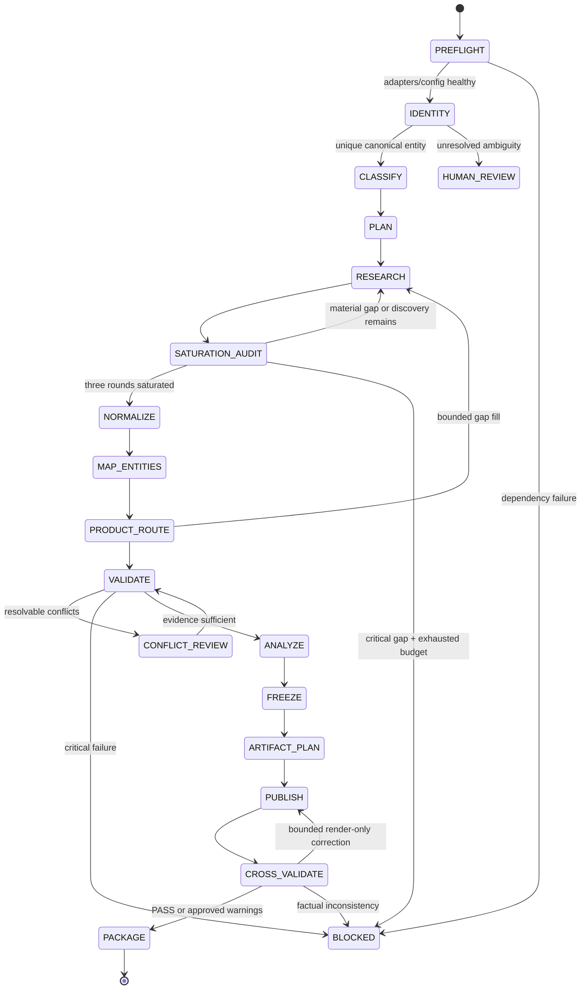

# Workflow

## 1. State machine



## 2. Run state

`ResearchState` must carry references, not uncontrolled payloads:

```yaml
run_id: RUN-...
request_id: REQ-...
status: PREFLIGHT|RUNNING|HUMAN_REVIEW|BLOCKED|PASS|PASS_WITH_WARNINGS
canonical_entity_id: ENT-...
complexity: GROUP_LARGE|ENTERPRISE_NORMAL|SMALL_SIMPLE|UNKNOWN
research_plan_id: PLAN-...
evidence_version: integer
freeze_id: null|FREEZE-...
artifact_manifest_id: null|AM-...
active_gaps: []
blocking_findings: []
budgets: {}
node_attempts: {}
```

Large page text, images and artifact binaries live in stores and are addressed by ID/hash.

## 3. Node contracts

### `InputNormalizer`

- Normalize whitespace, corporate suffixes, locale and optional target date.
- Preserve the user's raw input.
- Reject empty/non-company inputs with an actionable error.

### `CompanyResolver`

- Generate candidate entities from official/company registry/government evidence.
- Compare legal name, aliases, domain, location, parent and controller.
- Emit a scored candidate list and supporting `claim_id` values.
- Continue automatically only above configured uniqueness and confidence thresholds.

### `EnterpriseComplexityClassifier`

- Read `enterprise_rules.yaml`.
- Record each signal and its evidence.
- Treat `UNKNOWN` as a bounded normal-depth research path followed by reclassification.
- Never label the route as a legal enterprise-size determination.

### `ResearchPlanner`

- Build a query matrix for official site, organization, ownership, subsidiaries, factories, products, parameters, operations, energy, green credentials, overseas activity, tenders, EIA/energy assessment, recruitment and images.
- For `GROUP_LARGE`, create recursive entity work items with depth and count ceilings.
- For `SMALL_SIMPLE`, omit group-depth work while retaining industry, factory, product, energy and cooperation modules.
- Assign every query a purpose, expected output, preferred source class and budget.
- For an initial natural-language request, preserve the fixed full plan unchanged and execute a separate additive reinforcement plan from the complete original sentence.
- For continuation research, parse all intents from the complete sentence without using delimiters as semantic boundaries; run only cumulative targeted and coverage-gap queries.

### `SearchExecutor`

- Call only `KimiWebBridgeAdapter` or `AnySearchAdapter`.
- For AnySearch, try each available bundled runtime in order (Python, Node.js, PowerShell, Bash). On transport failure, retain a redacted proxy diagnostic and continue; declare `UNAVAILABLE` only when all present runtimes fail.
- Treat anonymous AnySearch access as valid. A missing API key is not itself a failure and must not trigger an unapproved provider fallback.
- Run adapter preflight and authentication checks as required.
- Store raw response metadata, canonical URL, retrieval timestamp and content hash.
- Deduplicate normalized query + domain + entity combinations.
- On failure, emit a typed diagnostic; do not improvise another web stack.
- Block an enterprise query that does not explicitly contain its canonical company subject. A frontier query names both the canonical company and the discovered related entity/event.

### `DataSaturationValidator`

- Require R1 coverage, R2 depth and R3 triangulation for every scoped goal.
- Load `config/collection_saturation_policy.yaml`; never duplicate numeric floors in prompts.
- Audit query attempts, source/source-type coverage, full-text captures, material records, independent verification and raw captures.
- Require two consecutive no-new-high-priority batches and marginal high-priority yield at or below 5%.
- Refuse to treat a reached quota or exhausted budget as evidence of completeness.

### `EntityMapper`

- Link parent, ownership, subsidiary, factory, product and process nodes.
- Preserve uncertain edges with confidence and verification status.
- Do not collapse similarly named legal entities.

### `ProductDetector`

- Require evidence that an identified item is a physical product sold/manufactured by the target entity.
- Emit `has_physical_products`, confidence, count and qualifying product IDs.
- Build a verified catalog scope from all official parent/subsidiary product centers. Enumerate navigation categories, pagination, tabs and detail URLs before measuring coverage.
- Distinguish family, series and model/SKU; expand each family where official pages disclose named grades or models.
- Compare catalog items against verified product records and emit `COMPLETE`, `PARTIAL` or `NOT_ASSESSED`, unresolved items and a coverage ratio.
- A non-empty product list is not proof of completeness. Open catalog or parameter gaps must survive into the freeze and force cautious wording.
- Route false/insufficient results to `SKIP_PRODUCT_DASHBOARD`.

### `EvidenceNormalizer`

- Create atomic claims; one claim should express one field/value/scope/date combination.
- Store raw text and surrounding context without rewriting it as evidence.
- Separate sources, retrievals and claims so multiple claims can cite one source.
- Create image records separately from textual claims.

### `EvidenceValidator` and `ImageValidator`

- Apply [SOURCE_POLICY.md](SOURCE_POLICY.md) and [VALIDATION_SPEC.md](VALIDATION_SPEC.md).
- Group conflicts by entity + field + period + scope.
- Reject search snippets as core evidence.
- Reject unverified images from formal artifacts.
- After provenance validation, run `ImageAssetArchiver` on the exact verified `source_url`. Enforce the download ceiling, verify SHA-256, MIME type and decoded dimensions, and write a deterministic run-relative `local_asset_ref`.
- Product images are artifact-ready only after successful local archival. Formal product dashboards require archived coverage of every displayed product; any failed or missing binary creates a blocking image-asset gap.

### Analysts

- Read validated evidence only.
- Emit structured statements with evidence IDs, inference method, assumptions, uncertainty and on-site data needs.
- Never turn industry averages into company facts.

### `DataFreezeService`

- Require all critical findings resolved or explicitly blocked.
- Snapshot claims, sources, images, graph, products, energy profile and solutions.
- Compute hashes and prevent mutation.

### `ArtifactPlanner`

- Build an explicit list of claim/image/chart IDs per artifact/section.
- Encode skip decisions such as product dashboard omission.
- Resolve chart inputs before publishers begin.

### Publishers

- Consume only `freeze_id` and artifact bindings.
- Render missing optional values as `—` or a clearly labeled data gap.
- Keep source IDs visible or available in appendices/notes/tooltips.
- Return binary path, content hash, used IDs and diagnostics.

### `CrossArtifactValidator` and `PackagePublisher`

- Parse artifacts and compare used values/IDs against the manifest.
- Permit bounded layout corrections that do not change frozen facts.
- Require a new freeze for any factual change.
- Package only when the release policy allows it.

## 4. Research loop and budgets

Use a bounded three-round saturation loop:

1. Run R1 coverage and create the candidate-source/catalog/entity map.
2. Run R2 depth against every material R1 candidate and preserve full-text/raw captures.
3. Run R3 triangulation for critical claims, gaps and conflicts.
4. Recompute field coverage, official-roster reconciliation and marginal high-priority discovery yield.
5. Continue targeted batches until the saturation gate passes or a blocking budget/permission condition is proven.

For products, sufficient coverage means the official catalog scope was enumerated and reconciled. Follow subsidiary/product-brand domains recursively within budget and use at least two passes: catalog discovery, then model/parameter extraction.

Recommended configurable dimensions: maximum queries, pages, child entities, recursion depth, per-domain pages, image candidates, model calls, elapsed time and retry count.

### Search Recall pre-loop

Before formal evidence verification, run the shared Recall Core:

```text
Enterprise: Seed goals → source-lane variants → hydrated-page entity mining
→ P0/P1 bounded frontier → anomaly check for critical gaps
→ R1 → R2 gap → R3 conflict → R4 coverage

Daily: Topic seeds → bounded intent/alias/language expansion → PRIMARY
→ P0/P1 one-hop frontier → source roster → RECOVERY → UPDATE
→ hydration/extraction → freshness → same-event dedupe
→ recency, confidence, authority, score → Top 5
```

Daily P2/P3 entries do not expand.  Daily converges after at least two recall
rounds when the frontier round yields no new P0/P1 entry.  Enterprise requires
at least three classified recall rounds and two consecutive no-new-P0/P1
rounds to claim `RECALL_SATURATED`; otherwise it reports an honest bounded or
partial status.  Each skipped URL receives a typed disposition and every query
is represented in the recall audit.

Enterprise Recall and the established R1 evidence plan use separate page
budgets.  Recall may add leads but may never reduce the original page allowance
or remove a Goal Family; verified-evidence yield and per-topic coverage remain
the acceptance metrics, not raw hit count.

### Supplemental requirement loop

Every requirement entered on the portal is routed into one or more isolated
topics plus an open custom topic. Each topic receives its own R1 official-source
coverage, R2 hydrated full-text/detail-page extraction and R3 independent
triangulation. These searches use the same source grading, extraction contract,
claim verification and entity boundary as the fixed enterprise chapters.

If a topic remains unsupported, publication stays internal and runs as many as
ten additional recovery rounds using the configured distinct source strategies.
Record the exact requirement hash, topic, query rounds, active/blocked adapter
counts, hydrated pages, extracted batches and verified-claim delta on every
round. Exhaustion is per requirement and per topic: failed or fully blocked
rounds never count. Only ten executed rounds may authorize a visible public
evidence gap; another topic's or another entity's facts cannot satisfy it.

## 5. Human review states

Request review only for decisions that cannot be made safely:

- ambiguous company identity;
- legal/group boundary conflict with no authoritative resolution;
- required image unavailable or authenticity disputed;
- core value conflict after source/scope analysis;
- permission or authentication required for an approved adapter;
- explicit acceptance of non-critical warnings before release.

Save checkpoints and provide candidate choices with evidence. Do not discard completed research.

## Decision-driven research loop

After identity coverage, plan analytical questions as first-class Goal Families: strategic trajectory, business drivers, customer/market proof, competitive position, enterprise risks and cooperation timing. Each query carries `interpretation_goal`, evidence/counterevidence patterns, time scope, comparison requirement and history requirement. Continue research while a new batch can change a strategic conclusion or cooperation hypothesis; stop when decision saturation is reached, not when every public field has a value. Run the cooperation contract after every material evidence delta and explicitly retain rejected candidates.

The 30/60/90 sequence is business-led: 30 days confirms the target problem and enterprise owner; 60 days validates the value mechanism and critical relationships; 90 days makes an invest/adjust/stop resource decision. Data requests are supporting inputs, never milestones by themselves.

## 6. Resume and idempotency

- Key node results by `run_id`, node version, input hash and effective config hash.
- Reuse retrieved content by URL/content hash within policy.
- Resume after the last successful checkpoint.
- Re-run downstream nodes when a freeze or artifact specification changes.
- Never reuse a prior company's facts solely because names are similar.
